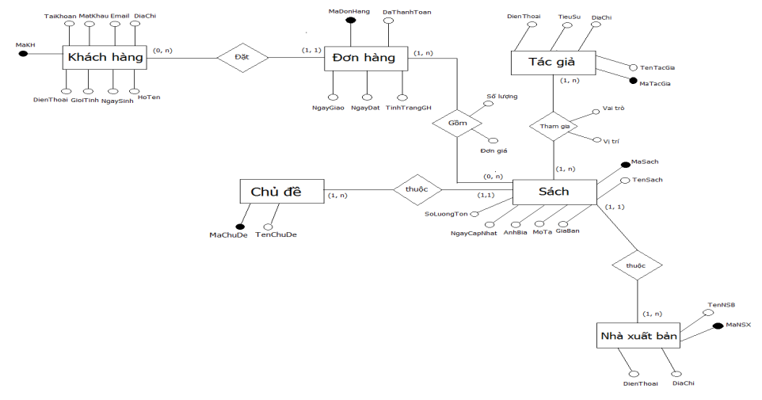
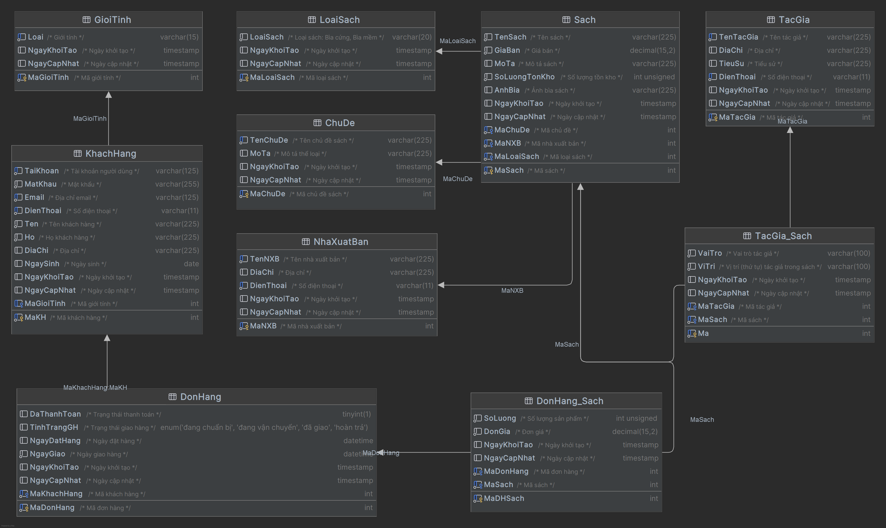

# BC Java - Assignment 05 - MySQL - QuanLyBanSach


<!-- TOC -->

* [BC Java - Assignment 05 - MySQL - QuanLyBanSach](#bc-java---assignment-05---mysql---quanlybansach)
    * [Requirements](#requirements)
    * [Prerequisites](#prerequisites)
        * [Project Structure](#project-structure)
        * [Environment](#environment)
    * [Database Overview](#database-overview)
    * [Solution](#solution)
    * [Author](#author)

<!-- TOC -->

## Requirements

Based on the ERD diagram below, design and implement a relational database (MySQL) named
`db_QLBanSach`.



## Prerequisites

### Project Structure

```text
./
│   initialize.sql
│   QLBanSach.sql
│   README.md
│
└───assets
        erd-diagram.png
        final.png
```

### Environment

- IDE: DataGrip
- Database: MySQL 8.4

## Database Overview

The schema models a bookstore system with 10 tables:

| Table          | Description                                                  |
|----------------|--------------------------------------------------------------|
| `ChuDe`        | Book topics / genres                                         |
| `GioiTinh`     | Customer gender lookup                                       |
| `NhaXuatBan`   | Publishers                                                   |
| `TacGia`       | Authors                                                      |
| `LoaiSach`     | Book type (hardcover / paperback)                            |
| `KhachHang`    | Customers                                                    |
| `Sach`         | Books                                                        |
| `DonHang`      | Orders                                                       |
| `TacGia_Sach`  | Many-to-many link between authors and books (role, position) |
| `DonHang_Sach` | Order line items (quantity, unit price)                      |

## Solution

1. Execute [QLBanSach.sql](./QLBanSach.sql) to create the database schema.
   The diagram below was exported from the schema in DataGrip:

   

2. *(Optional)* Execute [initialize.sql](./initialize.sql) **after** the schema script to insert
   sample
   data. It must run after `QLBanSach.sql`, since the seed data depends on the tables it creates.

   > Sample data generated by Claude and verified.

## Author

Khang Nguyen
